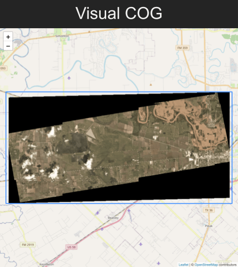

# stac-layer
> Visualize [STAC](https://stacspec.org/) Data on a [LeafletJS](https://leafletjs.com/) Map



# install
```bash
npm install stac-layer
```

# supported data types
- STAC Collection
- Item Collection
- STAC API Collections
- STAC API Items
- STAC Item
- STAC Asset

# usage

```js
import stacLayer from 'stac-layer';

// create your Leaflet map
const map = L.map('map');

// set options for the STAC layer
const options = {
  // see table below for supported options, for example:
  resolution: 128
};

// create layer
const layer = await stacLayer(data, options);

// add layer to map
layer.addTo(map);

// fit map to layer
map.fitBounds(layer.getBounds());
```

The following options are supported:

| **Option**                   | **Data Type** | **Default value**                          | **Description** |
| ---------------------------- | ------------- | ------------------------------------------ |-----------------------------------------------------------------------------------------------------------------------------------------------------------------------------------------------------|
| `baseUrl`                    | string        | `href` of the `self` link in the STAC data | The base URL for relative links. Should be provided if the STAC data has no self link and links are not absolute, or you pass a STAC Asset only. |
| `buildTileUrlTemplate`       | function      | undefined                                  | For server-side rendering of imagery. See the chapter [using a tiler](#using-a-tiler) and [buildTileUrlTemplate](#buildTileUrlTemplate) for details. |
| `crossOrigin`                | string\|null  | undefined                                  | The value for the [`crossorigin` attribute](https://developer.mozilla.org/en-US/docs/Web/HTML/Attributes/crossorigin) that is set when loading images through the browser. |
| `displayGeoTiffByDefault`    | boolean       | false                                      | Allow to display non-cloud-optimized GeoTiffs by default, which might not work well for larger files. |
| `displayPreview`             | boolean       | false                                      | Allow to display the asset with role `thumbnail` or the link with relation type `preview`. The previews are usually not covering the full extents and as such may be placed incorrectly on the map. |
| `displayOverview`            | boolean       | true                                       | Allow to display the asset with role `overview` or `visual`. |
| `debugLevel`                 | integer       | 0                                          | The higher the value the more debugging messages will be logged to the console. `0` to disable logging. |
| 1. `latLngBounds`<br />2. `bounds`<br />3. `bbox` | 1. [latLngBounds](https://leafletjs.com/reference.html#latlngbounds)<br />2. [bounds](https://leafletjs.com/reference.html#bounds)<br />3. [West, South, East, North] | undefined                                  | Provide one of these options if the data is a STAC Assets only: The bounding box of the asset |
| `resolution`                 | integer       | 32                                         | Adjust the display resolution, a power of two such as 32, 64, 128 or 256. By default the value is set to render quickly, but with limited resolution. Increase this value for better resolution, but slower rendering speed (e.g., 128). |
| `tileUrlTemplate`            | string        | undefined                                  | For server-side rendering of imagery. See the chapter [using a tiler](#using-a-tiler) and [tileUrlTemplate](#tileUrlTemplate) for details. |
| `useTileLayerAsFallback`     | boolean       | false                                      | Enables server-side rendering of imagery in case an error has happened on the client-side. See the chapter [using a tiler](#using-a-tiler) and [useTileLayerAsFallback](#useTileLayerAsFallback) for details. |

## using a tiler
There's are a couple different ways to use a tiler to serve images of assets 
that are Cloud-Optimized GeoTIFFs.

**Note:** To enforce using server-side rendering of imagery `useTileLayerAsFallback` must be set to `false` and either `tileUrlTemplate` or `buildTileUrlTemplate` must be given.

### tileUrlTemplate
You can set `tileUrlTemplate`, which will be passed to Leaflet's [TileLayer](https://leafletjs.com/reference-1.7.1.html#tilelayer). This will apply to whichever asset stac-layer chooses as the best GeoTIFF for visualization.
```js
// a STAC Feature
const layer = await stacLayer(data, {
  tileUrlTemplate: "https://tiles.rdnt.io/tiles/{z}/{x}/{y}@2x?url={url}"
});
```

### buildTileUrlTemplate
If you need more dynamic customization, consider passing in a `buildTileUrlTemplate` function. You can use this function to change the tile url and its parameters depending on the 
type of asset.

```js
const layer = await stacLayer(data, {
  buildTileUrlTemplate: ({
    href, // the url to the GeoTIFF
    asset, // the STAC Asset object
    key, // the key or name in the assets object that points to the particular asset
    stac, // the STAC Item or STAC Collection, if available
    bounds, // LatLngBounds of the STAC asset
    isCOG: true, // true if the asset is definitely a cloud-optimized GeoTIFF
    isVisual: true, // true when the asset's key is "visual" (case-insensitive)
  }) => {
    // assets has three bands of RGB, so no need to specify bands
    if (isVisual) return "https://tiles.rdnt.io/tiles/{z}/{x}/{y}@2x?url={url}";

    // select first three bands for non-visual assets, such as NAIP 4-band imagery
    // where we might want to ignore the Near-Infrared Band
    else return "https://tiles.rdnt.io/tiles/{z}/{x}/{y}@2x?url={url}&bands=1,2,3"
  }
});
```

### useTileLayerAsFallback
If you'd like to only use a tiler if [GeoRasterLayer](https://github.com/geotiff/georaster-layer-for-leaflet) fails, set `useTileLayerAsFallback` to `true`.

```js
const layer = await stacLayer(data, {
  tileUrlTemplate: "https://tiles.rdnt.io/tiles/{z}/{x}/{y}@2x?url={url}",
  useTileLayerAsFallback: true
});
```

## listening to click events
STAC Layer added a "stac" property to Leaflet's onClick events that include the STAC information of what the user clicked.  It can be a STAC collection, feature, asset, or even an array of assets when a composite of multiple assets are being visualized.
```js
const featureCollection = ....; // a GeoJSON Feature Collection of STAC Features

const layer = await stacLayer(featureCollection);
layer.on("click", e => {
  const { type, data } = e.stac;
  // type is one of "Collection", "Feature", "Assets", or "Asset"
  // data is the item that was clicked in the collection
});
```

## accessing meta information
Sometimes you might like to know information about what is being visualized.
You can access this information through the `stac` key attached to the layer.
```js
const layer = await stacLayer(data, options);
```
`layer.stac` could be the following
```js
{
  "assets": [
    {
      "key": "visual",
      "asset": {
        "href": "https://storage.googleapis.com/open-cogs/stac-examples/20201211_223832_CS2.tif",
        "type": "image/tiff; application=geotiff; profile=cloud-optimized",
        "title": "3-Band Visual",
        "roles": [
          "visual"
        ],
        "eo:bands": [
          {
            "name": "band3",
            "common_name": "red",
            "center_wavelength": 645,
            "full_width_half_max": 90
          },
          {
            "name": "band2",
            "common_name": "green",
            "center_wavelength": 560,
            "full_width_half_max": 80
          },
          {
            "name": "band1",
            "common_name": "blue",
            "center_wavelength": 470,
            "full_width_half_max": 70
          }
        ]
      }
    }
  ],
  "bands": [
    {
      "name": "band3",
      "common_name": "red",
      "center_wavelength": 645,
      "full_width_half_max": 90
    },
    {
      "name": "band2",
      "common_name": "green",
      "center_wavelength": 560,
      "full_width_half_max": 80
    },
    {
      "name": "band1",
      "common_name": "blue",
      "center_wavelength": 470,
      "full_width_half_max": 70
    }
  ]
}
```

## listening to fallback events
STAC Layer fires a custom "fallback" event when an error occurs rendering
with GeoRasterLayer and it falls back to trying to use a tiler
```js
const layer = await stacLayer(data, options);
layer.on("fallback", event => {
  // event.error is the initial LeafletJS error event
  // that triggered the fallback

  // layer.stac metadata may change after fallback
  // so good to check again now
});
```
